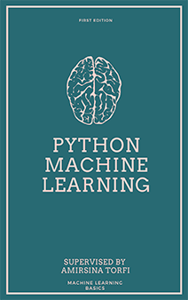

# Python 机器学习在线指南

> 原文：[Welcome to Python Machine Learning course!](https://machine-learning-course.readthedocs.io/en/latest/index.html)
> 
> 协议：[CC BY-NC-SA 4.0](http://creativecommons.org/licenses/by-nc-sa/4.0/)
> 
> 欢迎任何人参与和完善：一个人可以走的很快，但是一群人却可以走的更远。

* [在线阅读](SUMMARY.md)
## 赞助我

