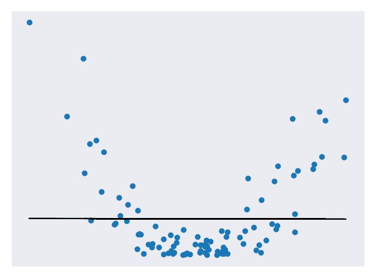
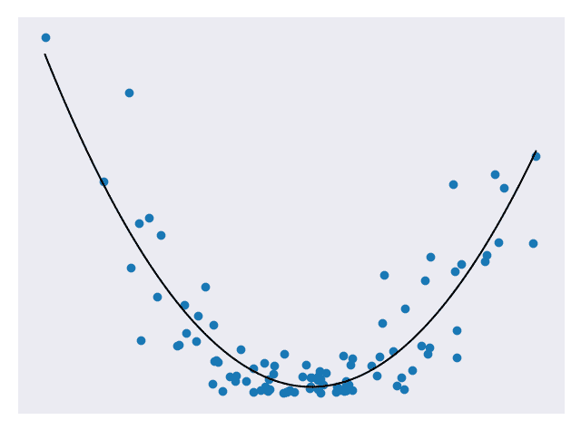
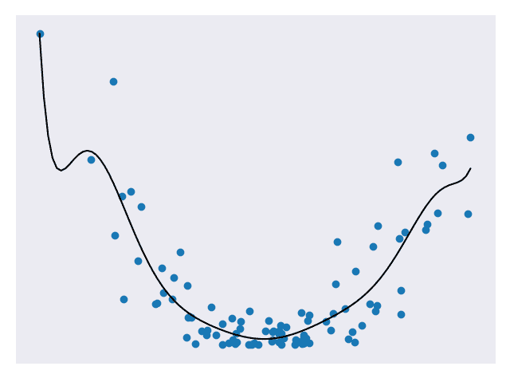
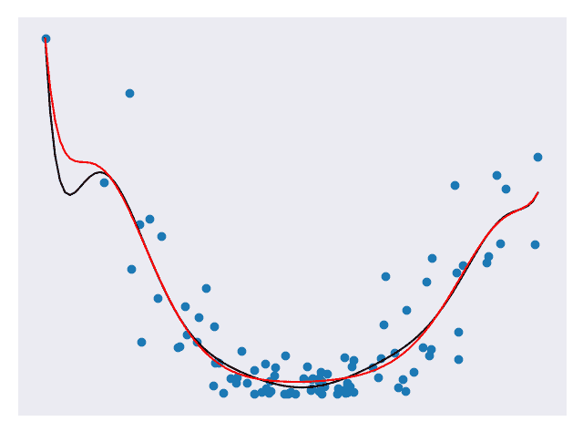
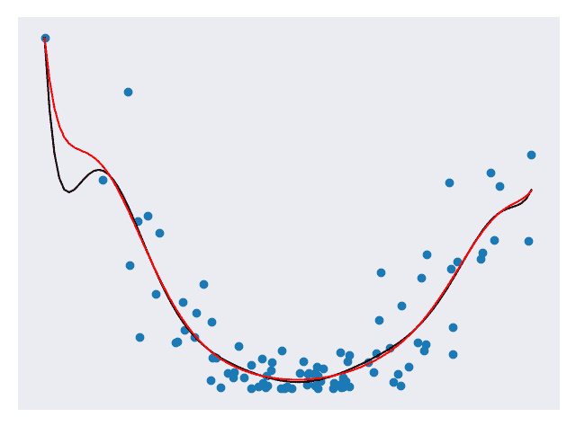

# 正则化

> 原文： [https://machine-learning-course.readthedocs.io/en/latest/content/overview/regularization.html](https://machine-learning-course.readthedocs.io/en/latest/content/overview/regularization.html)

## 动机

请考虑以下情形。 您正在制作花生酱三明治，并试图调整成分，使其具有最佳的味道。 您可以在决策过程中考虑面包的类型，花生酱的类型或花生酱与面包的比例。 但是您会考虑其他因素，例如房间的温度，早餐吃的东西或穿的袜子是什么颜色？ 您可能不会，因为这些东西对三明治的味道影响不大。 对于最终使用的任何食谱，您将更多地关注前几个功能，并避免过多地关注其他功能。 这是**正则化**的基本思想。

## 概述

在以前的模块中，我们已经看到了在某些样本集上训练的预测模型，并根据它们与测试集的接近程度对其评分。 我们显然希望我们的模型做出准确的预测，但是预测是否太准确？ 当我们查看一组数据时，有两个主要组成部分：基本模式和噪声。 我们只想匹配模式而不是噪声。 考虑下面的代表二次数据的图。 图 1 使用线性模型来近似数据。 图 2 使用二次模型来近似数据。 图 3 使用高级多项式模型来近似数据。

**图 1.线性预测模型** [[代码](https://github.com/machinelearningmindset/machine-learning-course/blob/master/code/overview/regularization/regularization_linear.py)]

**图 2.二次预测模型** [[代码](https://github.com/machinelearningmindset/machine-learning-course/blob/master/code/overview/regularization/regularization_quadratic.py)]

**图 3.高级多项式预测模型** [[代码](https://github.com/machinelearningmindset/machine-learning-course/blob/master/code/overview/regularization/regularization_polynomial.py)]

图 1 不适合数据，图 2 看起来非常适合数据，而图 3 非常适合数据。 在以上所有模型中，第三个可能是最适合测试集的模型。 但这不一定是一件好事。 如果再添加一些测试点，我们可能会发现第三个模型在预测它们时不再那么准确，但是第二个模型仍然相当不错。 这是因为第三种模型存在过拟合的问题。 过拟合意味着它在拟合测试数据（包括噪声）方面确实做得非常好，但在归纳为新数据时却表现不佳。 第二种模型非常适合数据，并且没有那么复杂以至于无法推广。

正则化的目标是通过惩罚更复杂的模型来避免过拟合。 正则化的一般形式涉及在成本函数中增加一个额外项。 因此，如果我们使用成本函数 CF，则正则化可能导致我们将其更改为 CF +λ* R，其中 R 是权重的某些函数，而λ是调整参数。 结果是权重较高（更复杂）的模型将受到更多惩罚。 调整参数基本上使我们可以调整正则化以获得更好的结果。 λ越高，权重对总成本的影响越小。

## 方法

我们可以使用许多方法进行正则化。 下面，我们将介绍一些更常见的用法以及何时使用它们。

### 岭回归

**Ridge 回归**是一种正则化类型，其中函数 R 涉及求和权重的平方。 公式 1 显示了修改后的成本函数的示例。

**公式 1。岭回归的成本函数**

公式 1 是正则化的示例，其中 w 表示我们的权重。 岭回归迫使权重接近零，但绝不会使权重为零。 这意味着所有功能都将在我们的模型中表示，但过拟合将被最小化。 当我们没有太多功能并且只想避免过拟合时，Ridge 回归是一个不错的选择。 图 4 比较了应用和不应用岭回归的模型。

**图 4.将岭回归应用于模型** [[代码](https://github.com/machinelearningmindset/machine-learning-course/blob/master/code/overview/regularization/regularization_ridge.py)]

在图 4 中，黑线表示未应用 Ridge 回归的模型，红线表示已应用 Ridge 回归的模型。 请注意红线的平滑程度。 针对将来的数据，它可能会做得更好。

在随附的 [regularization_ridge.py](https://github.com/machinelearningmindset/machine-learning-course/blob/master/code/overview/regularization/regularization_ridge.py) 文件中，添加岭回归的代码为：

添加 Ridge 回归就像在 Pipeline 调用中添加一个附加参数一样简单。 在这里，参数 alpha 表示我们的调整变量。 有关 scikit-learn 中 Ridge 回归的更多信息，请在处查阅[。](https://scikit-learn.org/stable/modules/generated/sklearn.linear_model.Ridge.html)

### LASSO 回归

**LASSO 回归**是一种正则化类型，其中函数 R 涉及求和权重的绝对值。 公式 2 显示了修改后的成本函数的示例。

**公式 2。LASSO 回归的成本函数**

公式 2 是用 w 表示权重的正则化示例。 请注意，岭回归和 LASSO 回归的相似程度。 唯一明显的区别是权重的平方。 这恰好对他们的工作产生了重大影响。 与岭回归不同，LASSO 回归可以强制权重为零。 这意味着我们生成的模型甚至可能不会考虑某些功能！ 在我们拥有一百万个仅需少量重要功能的功能的情况下，这是非常有用的结果。 拉索回归使我们避免过拟合，而将注意力集中在所有功能的一小部分上。 在原始情况下，我们最终将忽略那些对我们的三明治饮食体验没有太大影响的因素。 图 5 比较了应用 LASSO 回归和不应用 LASSO 回归的模型。

**图 5.将 LASSO 回归应用于模型** [[代码](https://github.com/machinelearningmindset/machine-learning-course/blob/master/code/overview/regularization/regularization_lasso.py)]

在上图中，黑线表示未应用 Lasso 回归的模型，红线表示已应用 Lasso 回归的模型。 红线比黑线平滑得多。 将 Lasso 回归应用于 10 级模型，但结果看起来它的阶数要低得多！ 拉索模型可能会更好地处理未来的数据。

在包含的 [regularization_lasso.py](https://github.com/machinelearningmindset/machine-learning-course/blob/master/code/overview/regularization/regularization_lasso.py) 文件中，添加 Lasso 回归的代码为：

添加 Lasso 回归与添加 Ridge 回归一样简单。 在这里，参数 alpha 表示我们的调整变量，`max_iter`表示要运行的最大迭代次数。 有关 scikit-learn 中 Lasso 回归的更多信息，请在处查阅[。](https://scikit-learn.org/stable/modules/generated/sklearn.linear_model.Lasso.html)

## 总结

在本模块中，我们学习了正则化。 通过正则化，我们找到了避免过拟合数据的好方法。 这是建模中常见但重要的问题，因此最好了解如何进行调解。 我们还探索了一些可在不同情况下使用的正则化方法。 这样，我们已经对机器学习的核心概念有了足够的了解，可以进入下一个主要主题监督学习。

## 参考文献

1.  <https://towardsdatascience.com/regularization-in-machine-learning-76441ddcf99a>
1.  <https://www.analyticsvidhya.com/blog/2018/04/fundamentals-deep-learning-regularization-techniques>
1.  <https://www.quora.com/What-is-regularization-in-machine-learning>
1.  <https://scikit-learn.org/stable/modules/generated/sklearn.linear_model.Ridge.html>
1.  <https://scikit-learn.org/stable/modules/generated/sklearn.linear_model.Lasso.html>