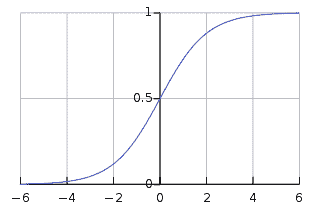

# 逻辑回归

> 原文： [https://machine-learning-course.readthedocs.io/en/latest/content/supervised/logistic_regression.html](https://machine-learning-course.readthedocs.io/en/latest/content/supervised/logistic_regression.html)

## 介绍

Logistic 回归是一种用于二分类的方法。 它可以将数据集中的点划分为两个不同的类或类别。 为了简单起见，我们将它们称为 A 类和 B 类。该模型将为我们提供给定点属于 B 类的可能性。如果该点较低（低于 50% ），则将其归为 A 类。否则，将其分类为 A 类。 同样，必须注意逻辑回归比具有阈值的线性回归更好，因为必须手动设置阈值，这是不可行的。 逻辑回归将创建一种 Sigmoid 曲线（使用 Sigmoid 函数），这也将有助于显示确定性，因为逻辑回归的输出不仅是一或零。 这是标准的逻辑函数，请注意输出始终在 0 到 1 之间，但永远不会达到这些值中的任何一个。

参考： [https://en.wikipedia.org/wiki/Logistic_regression](https://en.wikipedia.org/wiki/Logistic_regression)

## 何时使用

Logistic 回归非常适合需要在两个类别之间进行分类的情况。 一些很好的例子被接受和拒绝的申请者以及在比赛中的胜利或失败。 这是一个示例表，可以很好地进行逻辑回归。

| 学习 | | 成功 |
| --- | --- | --- |
| 小时 | 专心 | 通过？ |
| 1 | 假 | 假 |
| 3 | 假 | 真 |
| 0.5 | 真 | 假 |
| 2 | 假 | 真 |

请注意，学生的成功取决于输入，并且该值是二进制的，因此逻辑回归将在这种情况下很好地工作。

## 它是如何工作的？

Logistic 回归使用输入的线性组合进行工作，因此多个信息源可以控制模型的输出。 模型的参数是各个特征的权重，并表示它们对结果的相对重要性。 在下面的方程式中，您应该认识到线性回归中使用的公式。 从根本上说，逻辑回归是从线性预测变量到 0 到 1 之间的概率的转换。

参考： [https://en.wikipedia.org/wiki/Logistic_regression](https://en.wikipedia.org/wiki/Logistic_regression)

与线性回归一样，β值是权重，x 值是变量输入。 该公式给出了输入属于 B 类的可能性，这是逻辑回归模型的目标。

## 多项式 Lo​​gistic 回归

到目前为止，我们一直在讨论以下情况：恰好有两个不同的输出，例如通过或失败。 但是，如果有两个以上的可能输出呢？ 关于数字分类示例，其中输出可以是 0 到 9 之间的任何数字？

好吧，有一种方法可以通过逻辑回归来解决这个问题。 当使用 scikit-learn 库时，如示例代码所示，该功能已经存在。 使用 scikit-learn，您可以使用多项式模式并在训练数据中提供任意数量的课程。 您可以将这种方法视为创建多个模型并比较它们的概率，但是确切的[详细信息](https://en.wikipedia.org/wiki/Multinomial_logistic_regression)不在本课程的讨论范围之内。

## 代码

在我们的仓库中，查看[示例](https://github.com/machinelearningmindset/machine-learning-course/blob/master/code/supervised/Logistic_Regression/logistic_ex1.py)以进行逻辑回归。

在示例中，使用 scikit-learn 和 numpy 来训练简单的逻辑回归模型。 该模型是基本的，但可扩展。 使用逻辑回归，可以将更多功能无缝添加到数据集中，就像在 2D 数组中作为一列一样。

该代码创建代表训练输入的 2D 数组，在这种情况下为 1000 x 1，因为有 1000 个样本和 1 个特征。 这些输入的总分是 1000 分。还会创建一个训练输出数组，根据阈值将通过分类为 1，失败分类为 0。 然后，使用 scikit-learn 的 [LogisticRegression](https://scikit-learn.org/stable/modules/generated/sklearn.linear_model.LogisticRegression.html) 类将 Logistic 回归分类器拟合到数据中。 之后，下一步就是使用其他数据集测试准确率。 因此，我们创建了另外 100 个随机样本进行测试，并使用模型对其进行预测。

## 动机

为什么要使用逻辑回归？ Logistic 回归非常适合**二分类**或分为 2 类的情况。 逻辑回归也是一种相对简单的方法，利用输入的加权总和，类似于线性回归。 逻辑回归也很有用，因为它给出一个连续的值，代表给定分类正确的可能性。 出于这些原因，拥护者认为逻辑回归应该是数据科学界首先了解的[。](https://towardsdatascience.com/5-reasons-logistic-regression-should-be-the-first-thing-you-learn-when-become-a-data-scientist-fcaae46605c4)

## 总结

逻辑回归通过将线性回归扩展到分类来建立。 尽管它不能分类为两个以上的类，但是它的作用仍然很有效，并且易于实现。 将逻辑回归视为第一个思想通过/失败的方法。 当您仅需要数据通过/失败概率时，逻辑回归是最简单且可能是最佳选择。

机器学习库使使用 Logistic 回归非常简单。 在仓库中查看示例代码，然后继续。 基本思想是将训练数据作为输入和分类对提供，模型将自动构建。 与往常一样，请记住此仓库概述部分中提到的基础知识，因为没有适用于机器学习的万无一失的方法。

## 参考文献

1.  <https://towardsdatascience.com/logistic-regression-b0af09cdb8ad>
1.  <https://medium.com/datadriveninvestor/machine-learning-model-logistic-regression-5fa4ffde5773>
1.  <https://github.com/bfortuner/ml-cheatsheet/blob/master/docs/logistic_regression.rst>
1.  <https://machinelearningmastery.com/logistic-regression-tutorial-for-machine-learning/>
1.  <https://towardsdatascience.com/logistic-regression-a-simplified-approach-using-python-c4bc81a87c31>
1.  <https://hackernoon.com/introduction-to-machine-learning-algorithms-logistic-regression-cbdd82d81a36>
1.  <https://en.wikipedia.org/wiki/Logistic_regression>
1.  <https://en.wikipedia.org/wiki/Multinomial_logistic_regression>
1.  <https://scikit-learn.org/stable/modules/generated/sklearn.linear_model.LogisticRegression.html>
1.  <https://towardsdatascience.com/5-reasons-logistic-regression-should-be-the-first-thing-you-learn-when-become-a-data-scientist-fcaae46605c4>