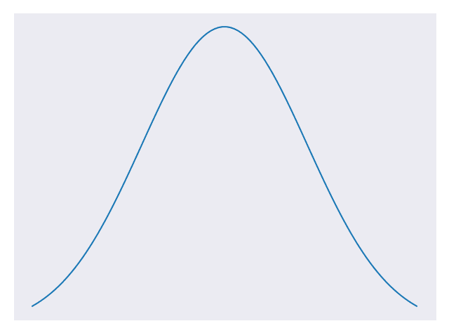

# 朴素贝叶斯分类

> 原文： [https://machine-learning-course.readthedocs.io/en/latest/content/supervised/bayes.html](https://machine-learning-course.readthedocs.io/en/latest/content/supervised/bayes.html)

## 动机

机器学习中经常出现的问题是需要将输入分类为某个预先存在的类。 考虑以下示例。

假设我们要对发现的随机分布的水果进行分类。 在此示例中，我们有三个现有的水果类别：苹果，蓝莓和椰子。 这些水果中的每一个都有我们关注的三个特征：大小，重量和颜色。 此信息显示在图 1 中。

|  | 苹果 | 蓝莓 | 椰子 |
| --- | --- | --- | --- |
| 尺寸 | 中等 | 小 | 大 |
| 重量 | 中等 | 轻 | 重 |
| 颜色 | 红色 | 蓝色 | 棕色 |

我们观察发现的那块水果，确定其大小适中，较重且为红色。 我们可以将这些功能与已知类的功能进行比较，以猜测它是哪种水果。 未知的水果像椰子一样重，但与苹果类具有更多的共同特征。 未知水果在苹果类别中具有 3 个特征中的 2 个，因此我们猜测它是一个苹果。 我们使用随机水果大小适中且像苹果一样红色的事实来猜测。

这个例子有点愚蠢，但是它突出了有关分类问题的一些基本要点。 在这些类型的问题中，我们正在将未知输入的特征与数据集中已知类的特征进行比较。 朴素贝叶斯分类是实现此目的的一种方法。

## 它是什么？

朴素贝叶斯是一种分类技术，它使用我们已经知道的概率来确定如何对输入进行分类。 这些概率与现有类及其具有的功能有关。 在上面的示例中，我们选择与输入最相似的类作为其分类。 该技术基于贝叶斯定理。 如果您不了解贝叶斯定理是什么，那就不用担心！ 我们将在下一部分中对其进行解释。

## 贝叶斯定理

贝叶斯定理[公式 1 ]是一个非常有用的结果，它在概率论和其他学科中都有体现。

**方程 1。贝叶斯定理**

利用贝叶斯定理，我们可以检查条件概率（事件发生的概率，如果发生另一事件发生）。 P（A | B）是在事件 B 已经发生的情况下事件 A 将发生的概率。 我们可以使用已知的有关事件 A 和事件 B 的其他信息来确定该值。我们需要知道 P（B | A）（假设事件 A 已经发生，事件 B 发生的概率），P（B）（概率 事件 B 将发生）和 P（A）（事件 A 将发生的概率）。 我们甚至可以将贝叶斯定理应用于机器学习问题！

## 朴素贝叶斯

朴素贝叶斯分类法使用贝叶斯定理和一些其他假设。 我们将假设的主要特征是功能是独立的。 假设独立性意味着给定特定类别出现一组特征的概率与给定该类别出现每个单个特征的所有概率的乘积相同。 在上面的水果示例中，红色不会影响中等大小的可能性，因此假设颜色和大小之间的独立性很好。 在特征可能具有复杂关系的现实世界问题中通常不是这种情况。 这就是为什么“朴素”是名字的原因。 如果数学看起来很复杂，请不要担心！ 该代码将为我们处理数字运算。 请记住，我们假设特征彼此独立以简化计算。

在这项技术中，我们接受一些输入，并计算它发生的可能性，因为它属于我们的类别之一。 我们必须为我们每个类的**执行此操作。 掌握了所有这些概率之后，我们将采用最大的概率作为我们对输入所属类别的预测。**

## 算法

以下是用于朴素贝叶斯分类的一些常见模型。 根据使用的特征分布类型，我们将它们分为两种一般情况：连续或离散。 连续表示实数值（可以有十进制答案），离散表示计数（只能有整数答案）。 还提供了每种算法的相关代码段。

### 高斯模型（连续）

高斯模型假设特征服从正态分布。 据您所知，正态分布只是概率值的一种特定类型，其中值趋于接近平均值。 如您在图 2 中所见，正态分布图呈钟形。 值在图的峰值附近最频繁，并且越远越难得。 这是另一个很大的假设，因为许多功能未遵循正态分布。 虽然这是事实，但假设正态分布会使我们的计算变得容易得多。 当特征不计数且包含十进制值时，我们使用高斯模型。

**图 2.具有标志性钟形曲线形状的正态分布** [[代码](https://github.com/machinelearningmindset/machine-learning-course/blob/master/code/supervised/Naive_Bayes/bell_curve.py)]

相关代码可在 [gaussian.py](https://github.com/machinelearningmindset/machine-learning-course/blob/master/code/supervised/Naive_Bayes/gaussian.py) 文件中找到。

在代码中，我们尝试从给定的 RGB 百分比猜测颜色。 我们创建一些数据来处理，其中每个数据点代表一个 RGB 三元组。 三元组的值是从 0 到 1 的十进制数，每个值都有与之关联的颜色类别。 我们创建一个高斯模型并将其拟合到数据中。 然后，我们使用新的输入进行预测，以查看应将其分类为哪种颜色。

### 多项式模型（离散）

当我们处理离散计数时，将使用多项式模型。 具体来说，我们在计算功能出现的频率时要使用它们。 例如，我们可能想计算“计数”一词在此页面上出现的频率。 图 3 显示了我们可能在多项模型中使用的数据类型。 如果我们知道计数将只是两个值之一，则应改用 Bernoulli 模型。

| 单词 | 频率 |
| --- | --- |
| Algebra | 0 |
| Big | 1 |
| Count | 2 |
| Data | 12 |

相关代码可在 [multinomial.py](https://github.com/machinelearningmindset/machine-learning-course/blob/master/code/supervised/Naive_Bayes/multinomial.py) 文件中找到。

该代码基于我们的水果示例。 在代码中，我们尝试从给定的特性中猜出一个结果。 我们创建一些数据以供处理，其中每个数据点都是代表水果特征（即大小，重量和颜色）的三元组。 三元组的值是介于 0 到 2 之间的整数，并且每个都有与之关联的水果类。 整数基本上只是与特征相关的标签，但是使用它们而不是字符串可以使我们使用多项模型。 我们创建一个多项模型并将其拟合到数据中。 然后，我们使用新的输入进行预测，以查看应将其分类为哪种水果。

### 伯努利模型（离散）

当我们处理离散计数时，也会使用伯努利模型。 与多项式情况不同，这里我们在计算是否发生了特征。 例如，我们可能要检查“ count”一词是否在此页面上全部出现。 当特征只有两个可能的值（例如红色或蓝色）时，我们也可以使用伯努利模型。 图 4 显示了我们可能在伯努利模型中使用的数据种类。

<caption>**Figure 4\. A table of word appearances on this page**</caption> | 字 | 当下？ |
| --- | --- |
| 代数 | 假 |
| --- | --- |
| 大 | 真正 |
| --- | --- |
| 计数 | 真正 |
| --- | --- |
| 数据 | 真正 |
| --- | --- |

相关代码可在 [bernoulli.py](https://github.com/machinelearningmindset/machine-learning-course/blob/master/code/supervised/Naive_Bayes/bernoulli.py) 文件中找到。

在代码中，我们尝试根据某物的某些特征来猜测某物是否为鸭子。 我们创建一些数据来处理，每个数据点都是代表特征的三元组：走路像鸭子一样，说话像鸭子一样，很小。 三元组的值为 true 或 false 的值为 1 或 0，并且每个值为鸭子或不是鸭子。 我们创建一个伯努利模型并将其拟合到数据中。 然后，我们用新的输入进行预测，以查看它是否是鸭子。

## 总结

在本模块中，我们了解了朴素贝叶斯分类。 朴素贝叶斯分类使我们可以根据现有类和特征的概率对输入进行分类。 如代码所示，您不需要大量的训练数据就可以使 Naive Bayes 有用。 另一个好处是速度，它可以用于实时预测。 我们对使用朴素贝叶斯（Naive Bayes）做出了很多假设，因此应以一粒盐作为结果。 但是，如果您没有太多数据并且需要快速得出结果，那么朴素贝叶斯是解决分类问题的理想选择。

## 参考文献

1.  <https://machinelearningmastery.com/naive-bayes-classifier-scratch-python/>
1.  <https://www.analyticsvidhya.com/blog/2017/09/naive-bayes-explained/>
1.  <https://towardsdatascience.com/naive-bayes-in-machine-learning-f49cc8f831b4>
1.  <https://medium.com/machine-learning-101/chapter-1-supervised-learning-and-naive-bayes-classification-part-1-theory-8b9e361897d5>