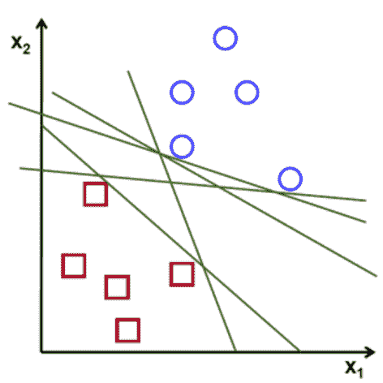
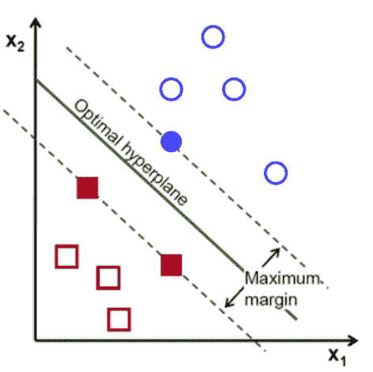
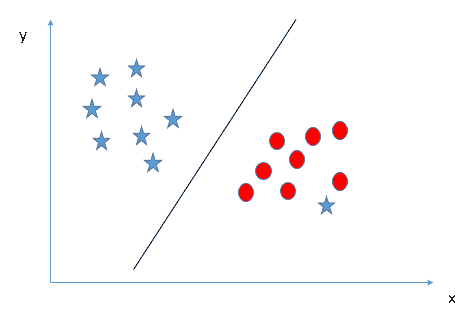
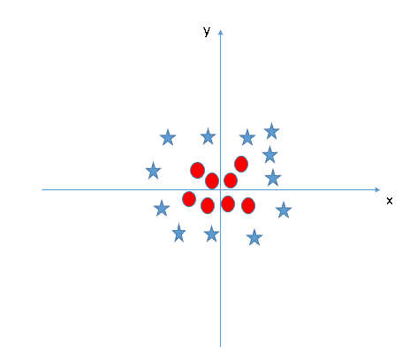
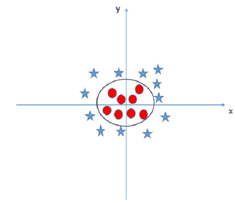
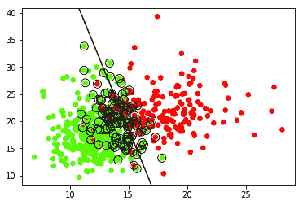

# 线性支持向量机

> 原文： [https://machine-learning-course.readthedocs.io/en/latest/content/supervised/linear_SVM.html](https://machine-learning-course.readthedocs.io/en/latest/content/supervised/linear_SVM.html)

## 介绍

**支持向量机**（简称 SVM）是用于对数据进行分类的另一种机器学习算法。 SVM 的要点是尝试找到一条线或**超平面**来划分维空间，从而最好地对数据点进行分类。 如果我们试图划分两个类 A 和 B，我们将尝试最好地用一条线将这两个类分开。 线/超平面的一侧将是 A 类的数据，而另一侧将是 B 类的数据。这种分类法在分类中非常有用，因为我们必须一次计算最佳的线或超平面，并且任何新的数据点都可以轻松地计算出来。 仅通过查看它们落在行的哪一侧即可对其进行分类。 这与 k 最近邻算法相反，在 k 算法中，我们必须计算每个数据点最近的邻居。

## 超平面

**超平面**取决于它所在的空间，但是它将空间分成两个断开的部分。 例如，一维空间将只是一个点，二维空间将是一条线，三维空间将是一个平面，依此类推。

## 我们如何找到最佳的超平面/直线？

您可能想知道可能会有多行将数据很好地拆分。 实际上，可以划分两类的行数是无限的。 正如您在下图中所看到的，每一行都将正方形和圆形分开，那么我们选择哪一个呢？



参考： [https://towardsdatascience.com/support-vector-machine-introduction-to-machine-learning-algorithms-934a444fca47](https://towardsdatascience.com/support-vector-machine-introduction-to-machine-learning-algorithms-934a444fca47)

那么 SVM 如何找到将这两类分开的理想直线呢？ 它不仅是随机选择一个。 该算法选择具有**最大边距**的线/超平面。 最大化边距将为我们提供对数据进行分类的最佳行。 如下图所示。



参考： [https://towardsdatascience.com/support-vector-machine-introduction-to-machine-learning-algorithms-934a444fca47](https://towardsdatascience.com/support-vector-machine-introduction-to-machine-learning-algorithms-934a444fca47)

## 如何最大化边距？

最接近直线的数据是确定最佳直线的因素。 这些数据点称为**支持向量**。 它们显示为上方的正方形和圆形填充。 这些向量到超平面的距离称为**边距**。 通常，这些点离超平面越远，正确分类数据的可能性就越大。 找到支持向量并最大化边距会涉及很多复杂的数学运算。 我们不会去讨论； 我们只想了解 SVM 背后的基本思想。

## 忽略异常值

有时，数据类将具有**离群值**。 这些数据点与班级其余部分明显分开。 支持向量机将忽略这些离群值。 如下图所示。



参考： [https://www.analyticsvidhya.com/blog/2017/09/understaing-support-vector-machine-example-code/](https://www.analyticsvidhya.com/blog/2017/09/understaing-support-vector-machine-example-code/)

带有红色圆圈的星星是异常值。 因此，SVM 将忽略异常值，并创建最佳行以将两个类分开。

## 核 SVM

会有无法用简单的线或超平面分开的数据类。 这被称为**非线性可分离数据**。 这是此类数据的示例。



参考： [https://www.analyticsvidhya.com/blog/2017/09/understaing-support-vector-machine-example-code/](https://www.analyticsvidhya.com/blog/2017/09/understaing-support-vector-machine-example-code/)

没有明确的方法将星星与圆圈分开。 通过使用称为**核技巧**的技巧，SVM 将能够对非线性可分离数据进行分类。 基本上，核技巧将点指向更高的维度，以将非线性可分离数据转换为线性可分离数据。 因此，上图将用圆圈分隔，以分隔数据。

这是核技巧的一个示例。



参考： [https://www.analyticsvidhya.com/blog/2017/09/understaing-support-vector-machine-example-code/](https://www.analyticsvidhya.com/blog/2017/09/understaing-support-vector-machine-example-code/)

有三种类型的核：

*   **线性**核
*   **多项式**核
*   **径向基函数（RBF）**核

您可以通过将“ model = svm.SVC（kernel ='linear'，C = 10000）”中的 kernel 值更改为“ poly”或“ rbf”来查看这些核如何改变最佳超平面的结果。 这是在 linear_svm.py 中。

## 总结

SVM 是一种很好的机器学习技术，可以对数据进行分类。 现在，我们对 SVM 有了一些了解，我们可以展示使用此分类器的优缺点。

SVM 的优点：

*   有效地对高维空间进行分类
*   节省内存空间，因为它仅使用支持向量来创建最佳行。
*   数据点可分离的最佳分类器

与 SVM 的缺点：

*   有大量数据集时效果不佳，训练时间更长。
*   当类重叠时，即不可分离的数据点，表现会很差。

## 动机

为什么要使用 SVM？ 可以对数据进行分类的模型很多。 为什么要使用这个？ 如果您知道数据点很容易分离，那么这可能是最好的分类器。 另外，可以使用核技巧来扩展它，因此请尝试使用不同的核，例如径向基函数（RBF）。

## 代码示例

请查看我们的代码 [linear_svm.py](https://github.com/machinelearningmindset/machine-learning-course/blob/master/code/supervised/Linear_SVM/linear_svm.py) ，以了解如何使用 Python 的 Scikit-learn 库实现线性 SVM。 有关 Scikit-Learn 的更多信息，请在中找到[。](https://scikit-learn.org)

[linear_svm.py](https://github.com/machinelearningmindset/machine-learning-course/blob/master/code/supervised/Linear_SVM/linear_svm.py) ，对从 Scikit-Learn 的数据集库加载的一组乳腺癌数据进行分类。 该程序将获取数据并将其绘制在图形上，然后使用 SVM 创建超平面以分离数据。 它还绕圈了确定超平面的支持向量。 输出应如下所示：



绿点被分类为良性。 红点归类为恶性。

这将从 Scikit-Learn 的数据集库中加载数据。 您可以将数据更改为所需的任何数据。 只要确保您拥有数据点和一系列目标即可对这些数据点进行分类。

```py
dataCancer = load_breast_cancer()
data = dataCancer.data[:, :2]
target = dataCancer.target

```

您也可以将核更改为“ rbf”或“多项式”。 这将创建一个不同的超平面来对数据进行分类。 您可以在此处的代码中进行更改：

```py
model = svm.SVC(kernel = 'linear', C = 10000)
model.fit(data, target)

```

## 参考文献

1.  <https://www.analyticsvidhya.com/blog/2017/09/understaing-support-vector-machine-example-code/>
1.  <https://stackabuse.com/implementing-svm-and-kernel-svm-with-pythons-scikit-learn/>
1.  <https://towardsdatascience.com/support-vector-machine-introduction-to-machine-learning-algorithms-934a444fca47>
1.  <https://towardsdatascience.com/https-medium-com-pupalerushikesh-svm-f4b42800e989>
1.  <https://towardsdatascience.com/support-vector-machines-svm-c9ef22815589>