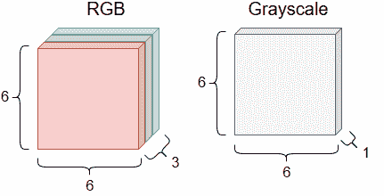
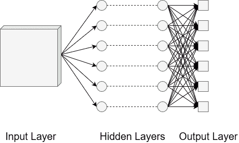
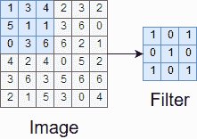
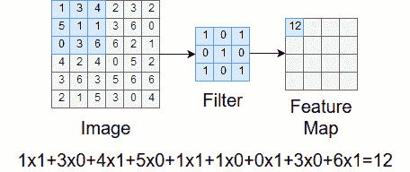
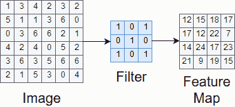
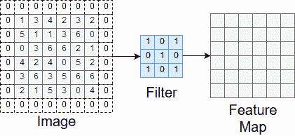
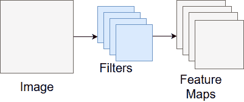
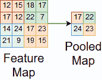
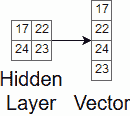
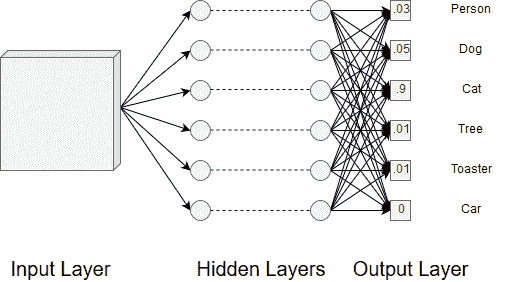

# 卷积神经网络

> 原文： [https://machine-learning-course.readthedocs.io/en/latest/content/deep_learning/cnn.html](https://machine-learning-course.readthedocs.io/en/latest/content/deep_learning/cnn.html)

## 概述

在最后一个模块中，我们通过讨论多层感知机来开始深入学习。 在本模块中，我们将学习**卷积神经网络**，也称为 **CNN** 或 **ConvNets** 。 CNN 与其他神经网络的不同之处在于，顺序层不一定完全连接。 这意味着输入神经元的子集只能馈入下一层的单个神经元。 CNN 的另一个有趣特征是其输入。 在其他神经网络中，我们可能会将向量用作输入，但是对于 CNN，我们通常会处理具有许多维度的图像和其他对象。 图 1 显示了一些分别为 6 像素乘 6 像素的示例图像。 第一张图像是彩色的，并具有三个用于红色，绿色和蓝色值的通道。 第二张图像是黑白图像，只有一个通道用于灰度值

**图 1.两个样本图像及其颜色通道**

## 动机

CNN 广泛用于我们试图分析视觉图像的计算机视觉中。 CNN 也可以用于其他应用，例如自然语言处理。 我们将在这里集中讨论前一种情况，因为它是 CNN 的最常见应用之一。

因为我们假设我们正在处理图像，所以我们可以设计架构，使其特别擅长分析图像。 图像具有高度，深度和一个或多个颜色通道。 在图像中，可能存在构成形状以及更复杂的结构（例如汽车和人脸）的线条和边缘。 为了正确地对图像进行分类，我们可能需要识别大量相关功能。 但是，仅识别图像中的单个特征通常是不够的。 假设我们有一张可能是或不是脸的图像。 如果我们看到三个鼻子，一个眼睛和一个耳朵，即使这些是脸部的常见特征，我们可能也不会称其为脸部。 因此，我们还必须考虑特征在图像中的位置以及它们与其他特征的接近程度。 这是要跟踪的很多信息！ 幸运的是，CNN 的架构将满足很多这些要求。

## 架构

CNN 的架构可以分为输入层，一组隐藏层和输出层。 这些在图 2 中显示。

**图 2\. CNN 的层**

隐藏的层是魔术发生的地方。 隐藏的层将分解我们的输入图像，以识别图像中存在的特征。 最初的层专注于诸如边缘之类的底层特征，而随后的层逐梯度得更加抽象。 在所有层的最后，我们都有一个完全连接的层，其中包含每个分类值的神经元。 我们最终得出的是每个分类值的概率。 我们选择概率最高的分类作为对图像显示内容的猜测。

下面，我们将讨论在隐藏层中可能使用的某些类型的层。 请记住，除最终输出层外，顺序层不一定完全连接。

### 卷积层

我们将讨论的第一种类型的层称为**卷积层**。 卷积描述来自数学中的卷积概念。 粗略地讲，卷积是一种作用于两个输入函数并产生输出函数的运算，该输出函数组合了输入中存在的信息。 第一个输入将是我们的图像，第二个输入将是某种滤镜，例如模糊或锐化。 当我们将图像与滤镜组合时，我们会提取一些有关图像的信息。 图 3 中显示了此过程。 这正是 CNN 提取特征的方式。

**图 3.过滤前后的图像**

在人眼中，单个神经元仅负责我们视野的一小部分。 通过许多具有重叠区域的神经元，我们才能够看到世界。 CNN 相似。 卷积层中的神经元仅负责分析输入图像的一小部分，但重叠，因此我们最终将分析整个图像。 让我们研究一下我们上面提到的过滤器概念。

**过滤器**或**核**是卷积中使用的功能之一。 滤镜的高度和宽度可能会比输入图像小，并且可以认为是在图像上滑动的窗口。 图 4 显示了样本滤镜以及在卷积第一步中将与之交互的图像区域。

**图 4.图像的样本过滤器和样本窗口**

当滤镜在图像上移动时，我们正在计算卷积输出的值，称为**特征图**。 在每一步中，我们将图像样本中的每个条目相乘并逐元素过滤，并对所有乘积求和。 这将成为特征地图中的条目。 图 5 中显示了此过程。

**图 5.计算特征图中的条目**

窗口遍历整个图像后，我们便拥有了完整的特征图。 这在图 6 中显示。

**图 6.完整功能图**

在上面的示例中，我们将过滤器从某个先前位置水平移动了一个单位或垂直移动了一个单位。 此值称为**步幅**。 我们可以为跨步使用其他值，但到处使用一个值往往会产生最佳结果。

您可能已经注意到，我们最终得到的特征图的高度和宽度比原始图像样本小。 这是我们在样本周围移动过滤器的方式的结果。 如果希望特征图具有相同的高度和宽度，则可以**填充**样本。 这涉及在样本周围添加零项，以便移动过滤器以将原始样本的尺寸保留在特征图中。 图 7 说明了此过程。

**图 7.应用过滤器之前的填充**

特征图表示我们要分析图像的一种类型的特征。 通常，我们想分析图像中的一堆特征，因此最终得到一堆特征图！ 卷积层的输出是一组特征图。 图 8 显示了从图像转到生成的特征图的过程。

**图 8.卷积层的输出**

在卷积层之后，通常有一个 **ReLU** （整流线性单元）层。 该层的目的是将非线性引入系统。 基本上，现实世界中的问题很少是线性的，因此我们希望我们的 CNN 在训练时予以考虑。 关于这一层的一个很好的解释需要我们不希望您知道的数学。 如果您对该主题感到好奇，可以在中找到说明[。](https://www.kaggle.com/dansbecker/rectified-linear-units-relu-in-deep-learning)

### 池化层

我们将介绍的下一种类型的层称为**池化层**。 池化层的目的是减小问题的空间大小。 反过来，这减少了 CNN 中处理所需的参数数量和计算总量。 池化有多种选择，但我们将介绍最常见的方法**最大池化**。

在最大池化中，我们在输入上滑动一个窗口，并在每一步取最大值。 图 9 中显示了此过程。

**图 9.特征图上的最大池化**

最大池化是好的，因为它保留了有关输入的重要功能，通过忽略较小的值来减少噪声，并减小问题的空间大小。 我们可以在卷积层之后使用这些，以使问题的计算可管理。

### 全连接层

我们将讨论的最后一种类型的层称为**全连接层**。 全连接层用于在 CNN 中进行最终分类。 它们的工作就像在其他神经网络中一样。 在移到第一个完全连接的层之前，我们必须将输入值展平为该层可以解释的一维向量。 图 10 显示了将多维输入转换为一维向量的简单示例。

**图 10.展平输入值**

完成此操作后，我们可能在最终输出层之前有几个完全连接的层。 输出层使用某些函数，例如 [softmax](https://developers.google.com/machine-learning/crash-course/multi-class-neural-networks/softmax) ，将神经元值转换为我们类上的概率分布。 这意味着图像有一定的可能性被归类为我们的类别之一，并且所有这些概率之和等于 1。 这在图 11 中清晰可见。

**图 11.最终概率输出**

## 训练

现在我们已经有了 CNN 的架构，我们可以继续进行训练了。 训练 CNN 与训练普通神经网络几乎完全相同。 由于卷积层的存在，增加了一些复杂性，但是训练策略保持不变。 诸如梯度下降或反向传播之类的技术可用于训练网络中的滤波器值和其他参数。 与我们涵盖的所有其他训练一样，拥有大量训练将提高 CNN 的表现。 训练 CNN 和其他深度学习模型的问题在于，它们比我们先前模块中介绍的模型复杂得多。 这就导致训练需要更多的计算资源，以至于我们需要像 GPU 这样的专用硬件来运行代码。 但是，我们得到了付款，因为深度学习模型比早期模块中涵盖的模型强大得多。

## 总结

在本模块中，我们学习了卷积神经网络。 CNN 与其他神经网络的不同之处在于，它们通常将图像作为输入，并且可能具有未完全连接的隐藏层。 CNN 是广泛用于图像分类应用的强大工具。 通过使用各种隐藏层，我们可以从图像中提取特征，并使用它们来概率地猜测分类。 CNN 也是复杂的模型，了解 CNN 的工作原理是一项艰巨的任务。 我们希望所提供的信息能使您更好地了解 CNN 的工作方式，以便您可以继续了解 CNN 和进行深度学习。

## 参考文献

1.  <https://towardsdatascience.com/convolutional-neural-networks-for-beginners-practical-guide-with-python-and-keras-dc688ea90dca>
1.  <https://medium.com/technologymadeeasy/the-best-explanation-of-convolutional-neural-networks-on-the-internet-fbb8b1ad5df8>
1.  <https://medium.freecodecamp.org/an-intuitive-guide-to-convolutional-neural-networks-260c2de0a050>
1.  <https://towardsdatascience.com/a-comprehensive-guide-to-convolutional-neural-networks-the-eli5-way-3bd2b1164a53>
1.  <https://ujjwalkarn.me/2016/08/11/intuitive-explanation-convnets/>
1.  <https://www.kaggle.com/dansbecker/rectified-linear-units-relu-in-deep-learning>
1.  <https://en.wikipedia.org/wiki/Convolutional_neural_network#ReLU_layer>